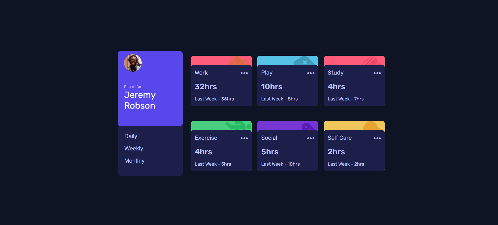

# Frontend Mentor - Time tracking dashboard solution

This is a time tracking dashboard project, inspired by the Frontend Mentor challenge. The goal of this project is to create a responsive user interface that allows the user to view time spent on different activities over three time periods: daily, weekly and monthly.
## Table of contents

- [Overview](#overview)
  - [The challenge](#the-challenge)
  - [Screenshot](#screenshot)
  - [Links](#links)
- [My process](#my-process)
  - [Built with](#built-with)
  - [What I learned](#what-i-learned)
- [Author](#author)

## Overview

### The challenge

Users should be able to:

- View the optimal layout for the site depending on their device's screen size
- See hover states for all interactive elements on the page
- Switch between viewing Daily, Weekly, and Monthly stats

### Screenshot

### Links

- Solution URL: [(https://github.com/Ataize/Time-tracking)]
- Live Site URL: [(https://ataize.github.io/Time-tracking/]]

## My process

### Built with

- Semantic HTML5 markup
- CSS custom properties
- Flexbox
- CSS Grid
- Mobile-first workflow
- Sass

### What I learned

- Using CSS Grid: I learned how to use CSS Grid to create responsive layouts, using grid-template-columns and minmax to define the layout columns;
- Responsive Design: Use media queries (@media) to ensure the design is adaptable to different screen sizes;
- Embedding External Fonts: I learned how to import and use custom fonts from Google Fonts;
- Modular CSS Structure: I used CSS variables to easily manage cores and other values ​​used in the design;
- Interactivity with JavaScript: I added interactivity using JavaScript to load data, switch views, and generate dynamic content.

## Author

- FreeCodeCamp - [(https://www.freecodecamp.org/Ataize)]
- Frontend Mentor - [(https://www.frontendmentor.io/profile/Ataize)]
- CodeAcademy - [(https://www.codecademy.com/profiles/ataizeFeitosa5951637940)]

